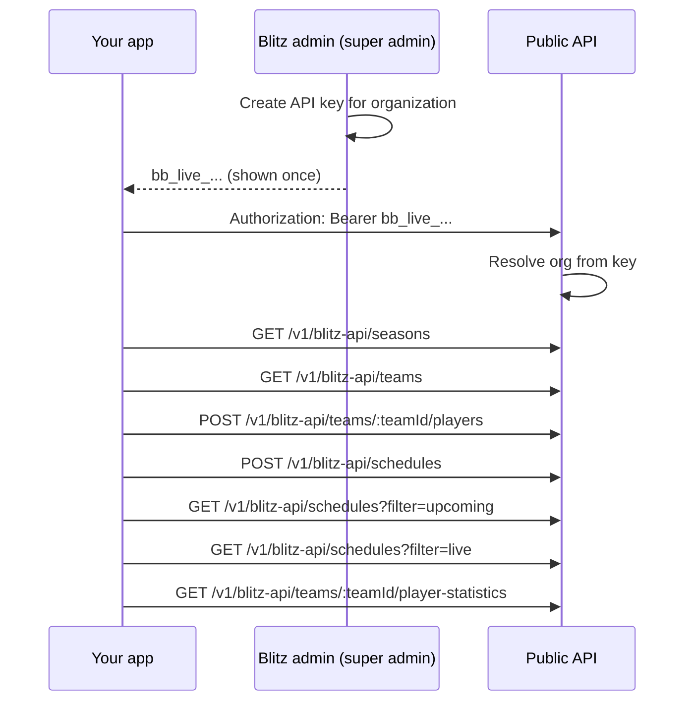

# BlitzBoard Public API

BlitzBoard helps leagues, coaches, and partners manage flag football programs with live game data, player analytics, and team performance. The **public integration API** lets external systems (ERPs, registration platforms, CRMs) create and sync **teams**, **players**, and **schedules** without using the BlitzBoard web UI.

## What you can build

<CardGroup cols={2}>
  <Card title="Sync teams" icon="users" href="/api-reference/endpoint/list-teams">
    List and manage teams that belong to the organization on your API key.
  </Card>
  <Card title="Roster players" icon="user-plus" href="/api-reference/endpoint/create-player">
    Add and update players on a team with idempotent creates.
  </Card>
  <Card title="Schedule events" icon="calendar" href="/api-reference/endpoint/create-schedule">
    Create games, practices, and other events under a team.
  </Card>
  <Card title="Player statistics" icon="chart-bar" href="/api-reference/endpoint/get-player-statistics">
    Fetch QB, offensive, defensive, punt, and return stat lists in one call.
  </Card>
  <Card title="Secure by design" icon="shield" href="/authentication">
    Organization-scoped API keys — one key cannot access another org’s data.
  </Card>
</CardGroup>

## Core ideas

| Concept | Detail |
| --- | --- |
| **Base path** | All public routes live under `/v1/blitz-api` |
| **Auth** | `Authorization: Bearer bb_live_...` (API key, not a login JWT) |
| **Create a key** | BlitzBoard **super admin** issues a key for an organization (admin API) |
| **Org scope** | The key’s `organizationId` is applied automatically — you do not pass org id on public team list/create |
| **Rate limit** | 100 requests per minute per public controller |
| **Request ID** | Responses include a request id for support and tracing |

## Typical integration flow

## Next steps

<CardGroup cols={2}>
  <Card title="Quickstart" icon="rocket" href="/quickstart">
    Create a key and make your first authenticated request in minutes.
  </Card>
  <Card title="Authentication" icon="key" href="/authentication">
    How Bearer API keys work vs login JWTs, create/rotate/revoke.
  </Card>
  <Card title="Concepts" icon="book-open" href="/concepts">
    Org scope, idempotency, errors, and rate limits.
  </Card>
  <Card title="API reference" icon="code" href="/api-reference/introduction">
    Full endpoint list for teams, players, schedules, and player statistics.
  </Card>
</CardGroup>
